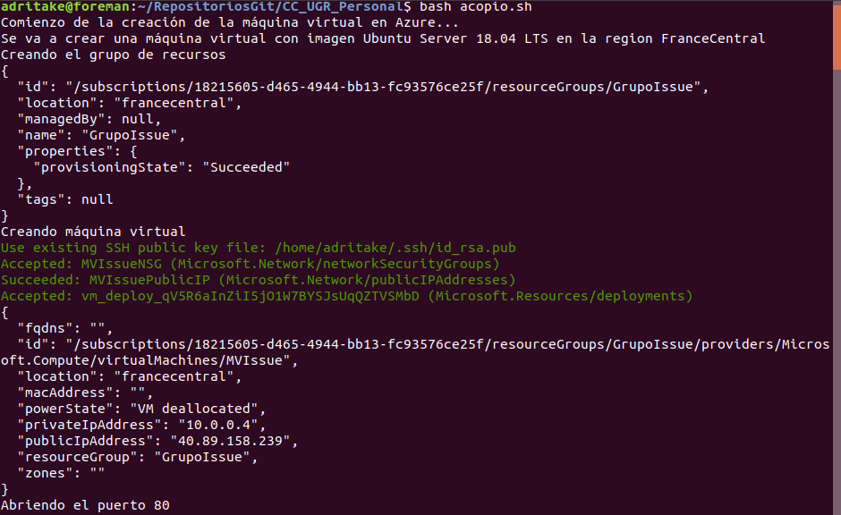
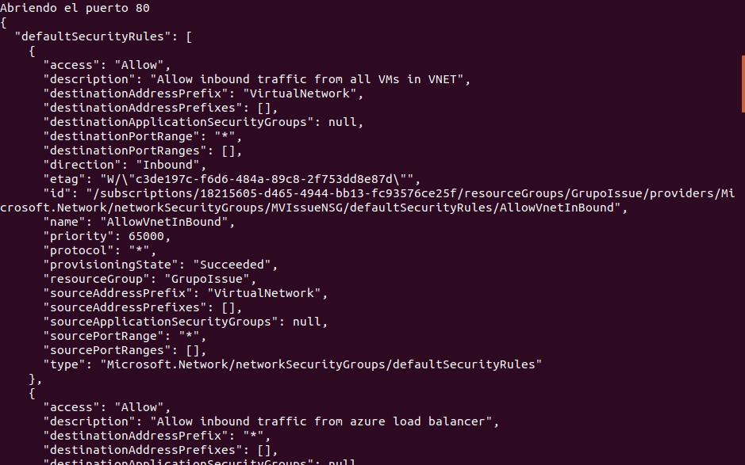

# Automatización de la creación de máquinas virtuales desde línea de órdenes
## Elección de la región del centro de datos

Para elegir qué región vamos a usar para crear nuestra MV se pretende medir la latencia a distintos centros de datos y quedarnos con la mejor. Una opción sería crear MV's idénticas en distintas regiones y medir su latencia con alguna herramienta como por ejemplo el comando `ping` de Ubuntu como se explica en esta [página web](http://somebooks.es/uso-del-comando-ping-ubuntu/).

He encontrado esta [página web](https://azurespeedtest.azurewebsites.net/) donde hace un ping a todas las regiones de Azure y va mostrando gráficamente su latencia. El código de esa página web se encuentra en este [repositorio](https://github.com/richorama/AzureSpeedTest2) de GitHub. A continuación se muestra el resultado de esta página web:


Como se puede observar, la región con mejor latencia es Francia Central por lo que será la elegida para albergar nuestro servicio.

## Elección de imagen

La imagen elegida para nuestro servicio va a ser Ubuntu Server 18.04 LTS porque como se indica en esta [página](https://www.colocationamerica.com/blog/best-operating-systems-for-business-and-personal-use) o en esta [otra](https://www.whoishostingthis.com/compare/operating-systems/), Ubuntu es la imagen que más se usa por ser sencilla, confiable y flexible. Además de tener las ventajas de ser software libre, se escoge la versión LTS (Long Term Support) para que esté mantenida por un largo periodo de tiempo.

## Script de Automatización

Para automatizar la creación de la máquina virtual se va a crear un script de bash. Los prerrequisitos para ejecutar este script es tener una cuenta y suscripción con dinero en Azure y por otro lado tener instalado el CLI de Azure. En el siguiente apartado se explica el funcionamiento del script:

### Funcionamiento del script
El script se encuentra en el siguiente [documento](../acopio.sh).

- Primero crea una serie de variables donde guardamos los parámetros de la MV. Establecemos como la región Francia central, la imagen va a ser la última de Ubuntu Server 18.04, el grupo de recursos se va a llamar "GrupoIssue" y la MV se va a llamar "MVIssue".
```bash
REGION="FranceCentral"
IMAGENSTR="Ubuntu Server 18.04 LTS"
GRUPO="GrupoIssue"
NOMBREMV="MVIssue"
IMAGEN="Canonical:UbuntuServer:18.04-LTS:latest"
```

- Creamos el grupo de recuros en Francia Central con el nombre GrupoIssue
```bash
#Creamos el grupo de recursos
echo "Creando el grupo de recursos"
az group create -l $REGION -n $GRUPO
```
- Creamos la MV con los parámetros indicados en las variables. También se indica que se generen claves ssh y que la salida sea en JSON y que la IP sea estática:


```bash
az vm create --resource-group $GRUPO --name $NOMBREMV --image $IMAGEN --generate-ssh-keys --output json --verbose --public-ip-address-allocation static
```
- Por defecto la MV se crea con el puerto 22 (SSH) abierto pero el puerto 80 se tiene que abrir:

```bash
az vm open-port --resource-group $GRUPO --name $NOMBREMV --port 80
```

Una vez hecho esto nuestra máquina debería estar creada e inicializada correctamente en Azure.

### Resultados del script
A continuación se muestran capturas de pantalla con las salidas de haber ejecutado el [script](../acopio.sh)





## Aprovisionamiento de la máquina

Para aprovisionar la MV se va a proceder de igual manera que en el [hito anterior](./Provision.md). Se va a usar el siguiente [playbook](../provision/MyPlaybook.yml) y la IP proporcionada al ejecutar el script anterior:


Ejecutamos `ansible-playbook provision/MyPlaybook.yml -i 40.89.158.239,` donde el parámetro *-i* indica una lista de IP's donde se desea ejecutar el playbook.

### Resultado del Aprovisionamiento


### Comprobación del despliegue

Para comprobar si la aplicación está funcionando correctamente se ha accedido a su IP mediante el explorador http://40.89.158.239/ y se ha obtenido:


