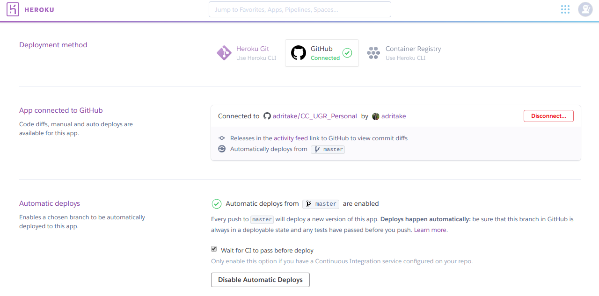

# Despliegue
## Pasos para despliegar el servicio
- El servicio va a ser desplegado en Heroku y para ello el primer paso es [darse de alta](https://id.heroku.com/login).
- Clonar este repositorio: `git clone https://github.com/adritake/CC_UGR_Personal.git`
- Si no tienes instalado el CLI de heroku sigue los siguientes pasos.
	* `sudo add-apt-repository "deb https://cliassets.heroku.com/branches/stable/apt ./"`
	* `curl -L https://cli-assets.heroku.com/apt/release.key |`
	* `sudo apt-key add -`
	* `sudo apt-get update`
	* `sudo apt-get install heroku`
- Ahora es el momento de subir el proyecto a Heroku, vamos a la carpeta del repositorio y ejecutamos: `heroku login`.
- Crear el repositorio para heroku: `heroku create`.
- Subirlo a Heroku con `git push heroku master`.
- Si ejecutas `heroku open` debería de abrirse el explorador y mostrar un mensaje JSON `{"status":"OK"}`

Con esto el servicio debería de estar funcionando en heroku. Si surge algún problema ejecutar `heroku logs --tail` para ver los posibles errores.

## Despliegue automático
Heroku permite desplegar la aplicación al hacer push al repositorio de github para ello hay que activarlo como aparece en la siguiente imagen:

