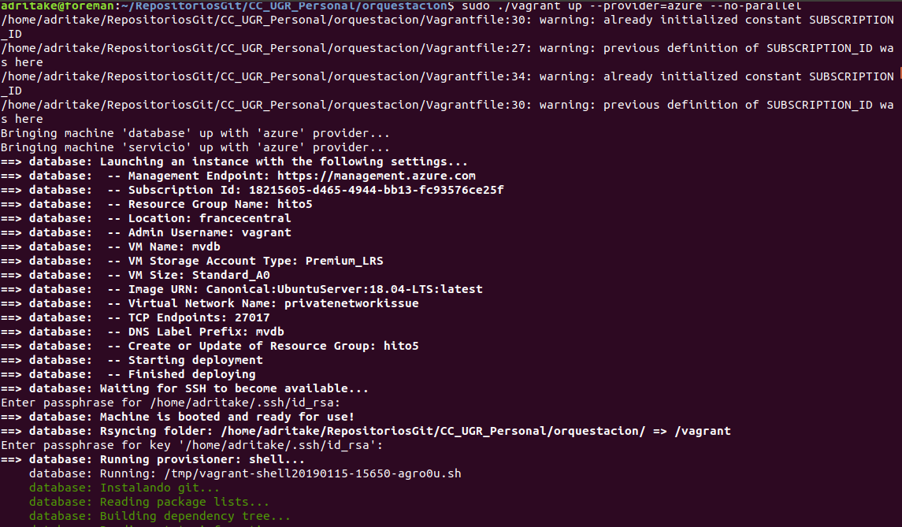
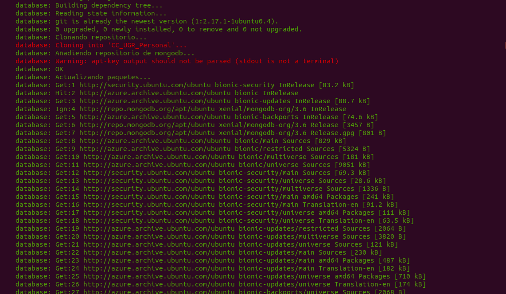
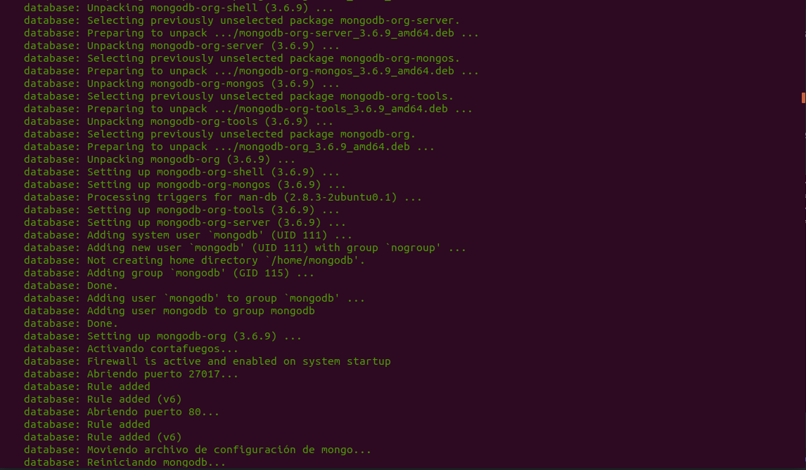
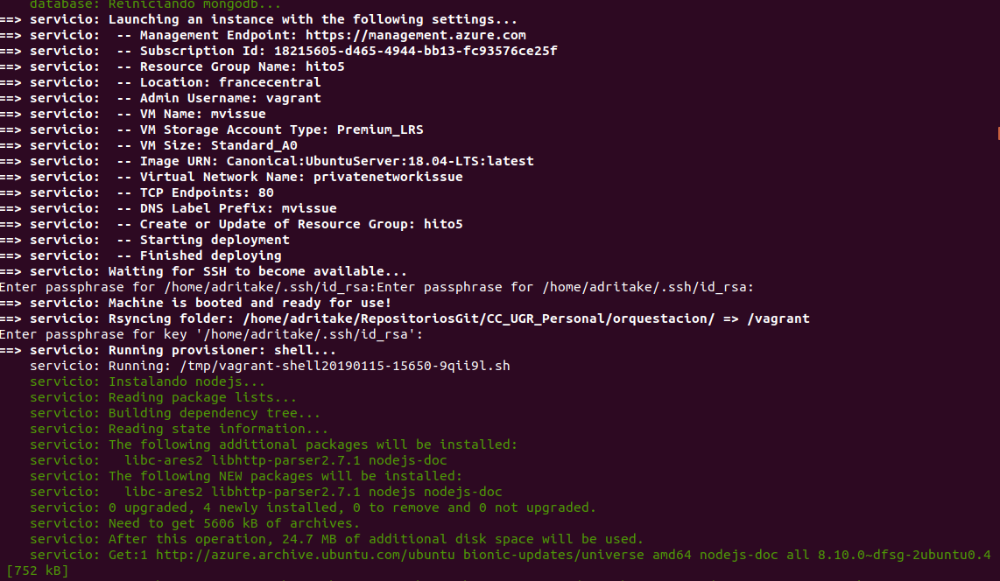
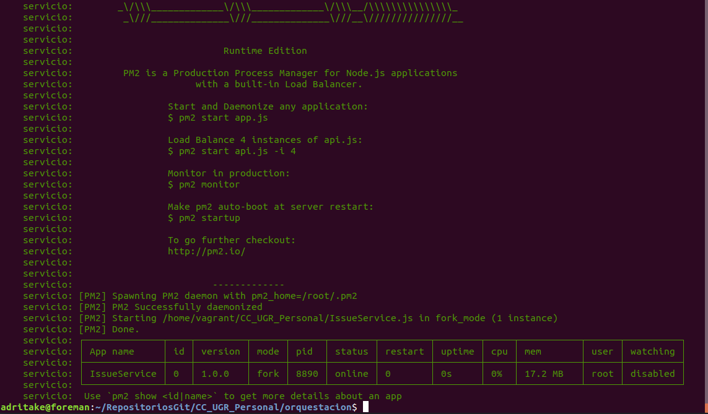
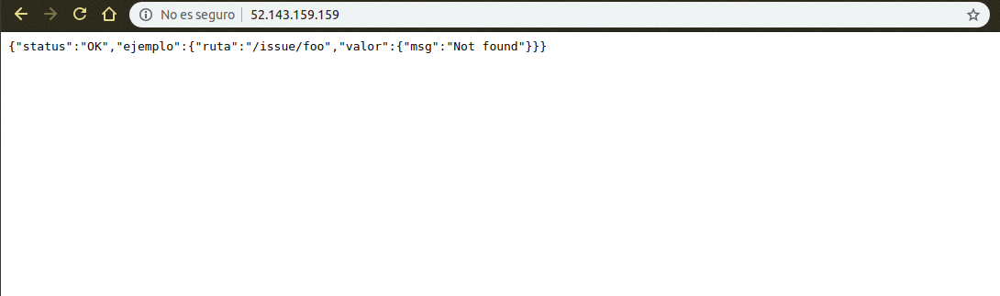

# Orquestación

En este documento se explica cómo se ha orquestado el proyecto con [Vagrant](https://www.vagrantup.com/) y los pasos necesarios para la replicación de esta orquestación.

## Elecciones

### Portal
Se ha elegido [Azure](https://azure.microsoft.com/es-es/) como centro de procesamiento de datos porque es el que más conocimiento tengo, ofrece todas las características necesarias para realizar este hito y además tiene mucha documentación para usar vagrant. Intenté hacerlo con la plataforma Google Cloud pero solo había de documentación un github de una persona y no conseguí hacerlo.

### Imagen
La imagen elegida para nuestro servicio va a ser Ubuntu Server 18.04 LTS porque como se indica en esta [página](https://www.colocationamerica.com/blog/best-operating-systems-for-business-and-personal-use) o en esta [otra](https://www.whoishostingthis.com/compare/operating-systems/), Ubuntu es la imagen que más se usa por ser sencilla, confiable y flexible. Además de tener las ventajas de ser software libre, se escoge la versión LTS (Long Term Support) para que esté mantenida por un largo periodo de tiempo.

### Tamaño de imagen
Se ha elegido el tamaño de imagen Standard_A0 debido a los siguientes motivos.

- Es la imagen más barata.
- El servicio está en fase de desarrollo por lo que su uso va a ser muy reducido y, por lo tanto, no es necesario usar una imagen con más prestaciones.

### Script de provisionamiento
Hasta ahora se había usado Ansible para provisionar máquinas virtuales, el cual ha demostrado su efectividad y sencillez. Por lo tanto, para aprender nuevas maneras de aprovisionar máquinas virtuales y por diferenciarme un poco del resto de proyectos se ha creado un [script](../orquestacion/scriptweb.sh) de bash para provisionar la MV del servicio y [otro](../orquestacion/scriptdb.sh) para la base de datos.

He encontrado la ventaja de que se usan las órdenes tal y como se usan en el ordenador de trabajo, por lo tanto es fácil de escribir y probar. El inconveniente es que es sólo válido para Ubuntu. Para otros sistemas operativos será necesario usar el [playbook](../provision/MyPlaybook.yml) que creé para el hito anterior.

### Región del centro de datos
Se han usado el mismo criterio que en el hito anterior explicado en este [documento](./Automatizacion.md). La región escogida ha sido Francia Central por tener la menor latencia.

## Prerrequisitos para la orquestación

- Tener instalado ruby
- Instalar la gema de ruby para leer JSON `gem install json`
- Tener instalado vagrant, yo he usado la versión 2.2.2
- Tener instalado el CLI de Azure

# Proceso de orquestación

- Me he descargado vagrant de su [página oficial de descarga](https://www.vagrantup.com/downloads.html) y lo he instalado.
- Para usar Azure como proveedor me he basado en su [documentación oficial](https://github.com/Azure/vagrant-azure) y he seguido los siguientes pasos.
- Hacer `az login` para loguearnos con el CLI de azure en la terminal.
-  En la documentación oficial se propone guardar los datos necesarios para la orquestación de vagrant en variables de entorno. Yo he decidido guardar esos datos en archivos JSON por comodidad a la hora de leerlos y de paso aprendo cómo se leen archivos JSON en ruby.
- Ejecutamos el comando `az ad sp create-for-rbac > azdata.json`. Este comando crea una aplicación de directorios activa de Azure con acceso al gestor de recursos de Azure para la subscripción activada. La salida de este comando es un JSON que se guarda en el archivo *azdata.json*
- Para leer archivos JSON y parsearlos me he basado en la información proporcionada en esta [página web](https://hackhands.com/ruby-read-json-file-hash/)
- A continuación necesitamos el id de nuestra subscripción de azure, para ello ejecutamos el comando `az account list --query "[?isDefault].id" -o tsv > idsubscripcion.txt` que devuelve el propio id en formato string y se almacena en el documento *idsubscripcion.txt*
- Para leer documentos en ruby me he basado en esta [pregunta de Stack Overflow](https://stackoverflow.com/questions/5545068/what-are-all-the-common-ways-to-read-a-file-in-ruby)
- Una vez hemos obtenido y almacenado todos los datos necesarios seguimos con la documentación de Azure. Añadimos la box de azure a vagrant con este comando `vagrant box add azure https://github.com/azure/vagrant-azure/raw/v2.0/dummy.box --provider azure` el cual la añade y le da el nombre de "azure".
- Instalamos el plugin de Azure para vagrant con `vagrant plugin install vagrant-azure`
- Creamos el archivo *Vagrantfile* el cual se encuentra programado en ruby y documentado [aquí](../orquestacion/Vagrantfile).
- Creamos el [script de aprovisionamiento](../orquestacion/scriptweb.sh) para el servicio y otro [script](../orquestacion/scriptdb.sh) para la base de datos. Para aprovisionar con script me he basado en la [documentación de vagrant](https://www.vagrantup.com/docs/provisioning/shell.html).
- Para comenzar la orquestación ejecutamos `vagrant up --provider=azure --no-parallel`. (Es posible que los comandos de vagrant sean necesario ejecutarlos con sudo). Se le de la opción de --no-parallel que significa que cree las MV secuencialmente. Si no le daba esa opción me salía error.

## Resultados
A continuación se muestra parte de la salida de ejecutar el Vagrantfile, se han omitido las salidas de instalación del paquetes de los scripts.

Resultado de la salida de la ruta raíz del servicio.

 ## Instrucciones para la corrección

 - Cumplir los prerrequisitos.
 - Añadir la box de azure: `vagrant box add azure https://github.com/azure/vagrant-azure/raw/v2.0/dummy.box --provider azure`.
 - Instalar el plugin de azure para vagrant: `vagrant plugin install vagrant-azure`
 - Clonar este repositorio `git clone https://github.com/adritake/CC_UGR_Personal.git`
 - Ir al directorio *CC_UGR_Personal/orquestacion*
 - Hacer `az login`
 - Ejecutar el comando `az ad sp create-for-rbac > azdata.json` para guardar los datos de tu cuenta.
 - Ejecutar el comando `az account list --query "[?isDefault].id" -o tsv > idsubscripcion.txt` para guardar los datos de tu subscripción.
 - Si tu instalación de vagrant es un ejecutable, moverlo al directorio.
 - Ejecutar `sudo ./vagrant up --provider=azure --no-parallel` para lanzar el Vagrantfile.
 - Nota: Si se queda pillado abriendo puertos en el aprovisionamiento de la primera MV, cancelar el proceso, borrar los recursos creados y volver a lanzar el vagrantfile. Si en la segunda MV da error al lanzar el servicio con pm2, conectarte con ssh a la MV y lanzarlo manualmente.
 - Acceder a la IP de la MV *mvissue* y comprobar que devuelve un JSON con status: OK
