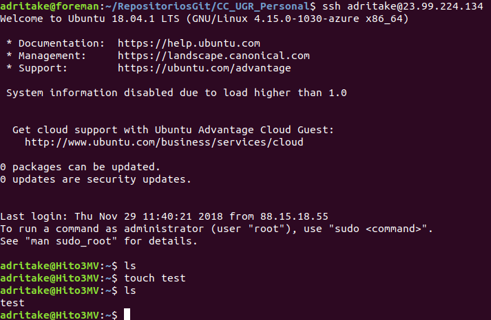
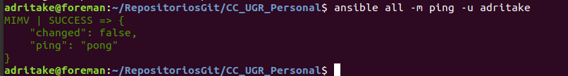
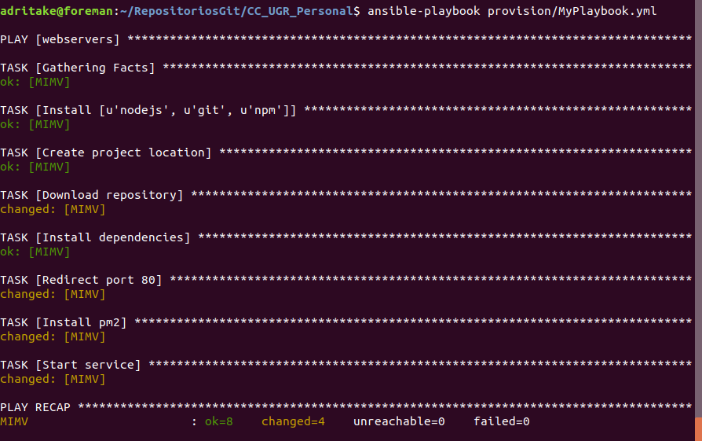

# Provisionamiento
## Explicación de herramientas utilizadas

Se va a crear una máquina virtual en el sistema cloud de [Azure](https://azure.microsoft.com/es-es/) ya que en los ejercicios lo hice en un MV local de VirtualBoxtengo y ahora prefiero avanzar y desplegarla en una plataforma más profesional. También tengo una suscripción de educación gratuita y además, esta plataforma ofrece un amplio abanico de servicios y máquinas virtuales, entre ellas la que voy a usar. Se ha elegido Ubuntu Server 18.04 porque todo el proyecto se ha desarrollado con este SO y se conoce que funciona perfectamente en él.

# Instrucciones para crear la MV en azure

- El primer paso es acceder al portal de [Azure](https://portal.azure.com/) e iniciar sesión.
- Seleccionar Crear recursos y buscar Ubuntu Server 18.04 VM.
- Para la configuración de la MV se ha seleccionado la subscripción "Hito 3" proporcionada por el profesor de la asignatura. Se ha creado un nuevo grupo de recursos llamado "Hito 3". El nombre de la MV es Hito3MV y la región se ha elegido "Centro de EE.UU.". La imagen es *Ubuntu Server 18.04 LTS*.
- Se ha elegido el tamaño Básico A0 ya que la aplicación requiere unas prestaciones mínimas que son suplidas por ese tamaño. Además es el tamaño más barato.
- Se ha elegido el método de autenticación por clave pública. Para ello se le da un nombre de usuario (en mi caso adritake) y se copia la clave pública de nuestro ordenador en el cuadro del formulario.
- Se ha seleccionado los puertos de entrada 80 (HTTP) y 22 (SSH) para podernos conectar a la MV desde fuera. También hay que abrir el puerto que va a usar la aplicación, en mi caso el puerto 5000.
- En discos se ha seleccionado HDD Estándar.
- En redes se ha dejado los valores que salían por defecto.
- En administración se han dejado los valores por defecto.
- En configuración de invitado no se ha introducido nada.
- En etiquetas tampoco se ha introducido nada.
- Una vez hecho todo se comprueban los datos de la MV en la sección Revisar y crear. Si todo está correcto pulsar crear. La creación de la MV lleva un rato...

## Comrpobación de que la MV se ha creado

Para comprobar que se ha creado la MV correctamente me he conectado con ssh a la IP de la MV y este es el resultado:


## Provisionamiento con Ansible

Para provisionar la MV se ha usado Ansible, para ello hay que incluir la IP de la MV en el archivo.

- Abrir con privilegios de súper usuario el archivo */etc/ansible/hosts* e introducir la siguiente línea:
```
[webservers]
MIMV ansible_host=23.99.224.134
```
- Probar que Ansible tiene acceso a la MV ejecutando `ansible all -m ping -u adritake`. En mi caso obtuve el siguiente resultado:

- El siguiente paso es crear un PlayBook para provisionar la MV. El playbook que he creado es el siguiente:
```
---
- hosts: webservers
  user: adritake

  vars:
    - packages: ["nodejs","git","npm"]
    - project_location: /home/adritake/projects

  tasks:
    - name: Install {{ packages }}
      become: yes
      become_user: adritake
      apt:
        name: "{{ packages }}"
        state: present

    - name: Create project location
      file:
        path: "{{ project_location }}"
        state: directory

    - name: Download repository
      git:
        repo: https://github.com/adritake/CC_UGR_Personal.git
        dest: "{{ project_location}}"

    - name: Install dependencies
      npm:
        path: "{{ project_location }}"

    - name: Install pm2
      become: yes
      become_user: root
      command: npm install pm2 -g

    - name: Start service
      command: pm2 start {{ project_location }}/IssueBot.js

```

- Al ejecutar `ansible-playbook provision/MyPlaybook.yml` se hacen todas las tareas y se debería obtener un resultado como este:



- Con esto nuestra aplicación ya estaría funcionando, ahora solo hay que probarla con Telegram y accediendo desde el explorador a http://23.99.224.134:5000/
